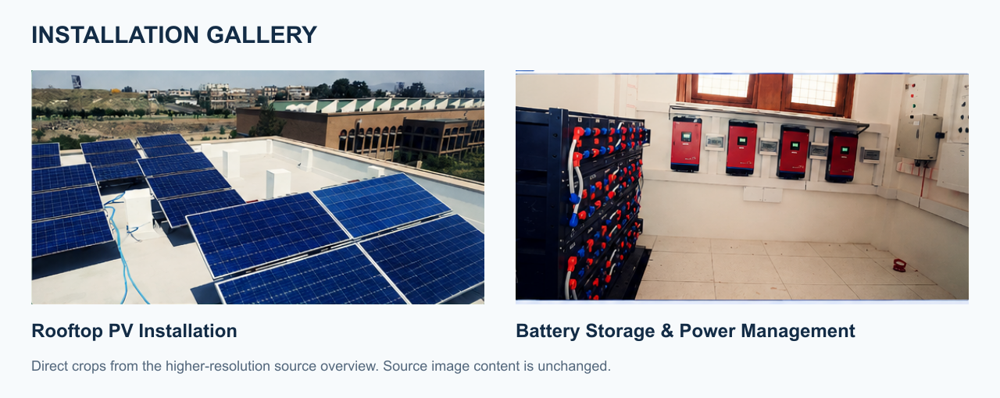
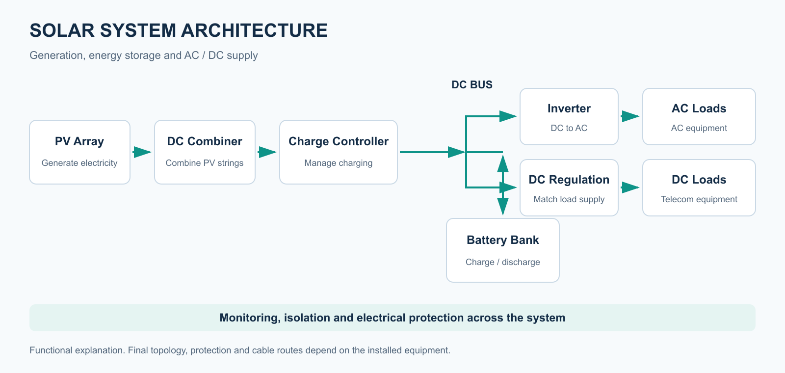
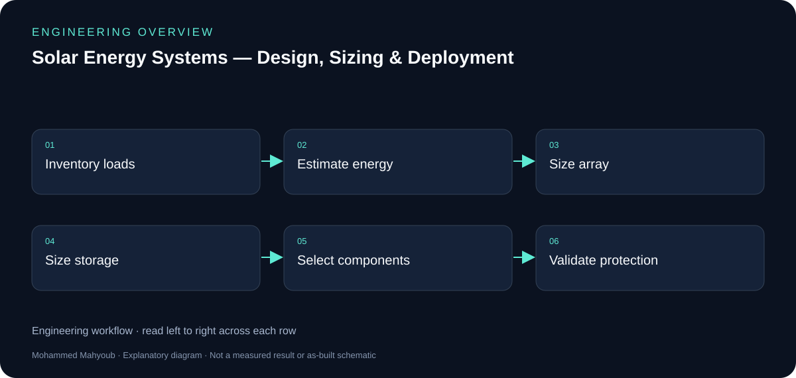
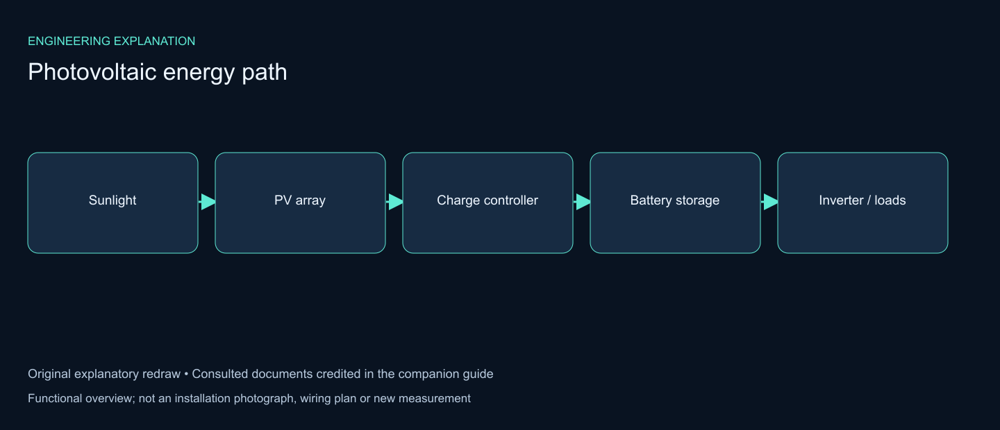

# Solar Energy Systems — Design, Sizing & Deployment

Implemented photovoltaic power-system engineering for remote telecommunications supply and backup, covering load assessment, system sizing, component selection, integration, wiring and protection.

## Installation overview

The source photographs show the rooftop photovoltaic array and the battery-storage and power-management installation. These are direct crops from a higher-resolution overview recovered from the local project archive.

## How the system works

The PV array generates DC electricity. The charge controller regulates battery charging; the battery bank stores energy, and the inverter converts DC power to AC for connected loads. This figure explains the AC supply path. Telecommunications equipment may use a dedicated DC supply path according to the installation design.

## Engineering scope

| Design area | Engineering purpose |
|---|---|
| Load assessment | Establish peak demand, operating hours and daily energy consumption. |
| PV array sizing | Relate generation capacity to energy demand, solar resource and system losses. |
| Battery sizing | Match usable storage to required autonomy and allowable depth of discharge. |
| Power conversion | Select an inverter for continuous demand and starting loads; coordinate controller ratings with array and battery characteristics. |
| Integration and protection | Coordinate voltage compatibility, cable selection, isolation and protective devices. |
| Deployment | Bring generation, storage and load supply together and assess operation using commissioning records. |

## Design and deployment workflow

Demand assessment establishes the design basis. Array and storage sizing guide equipment selection, followed by installation and commissioning. The workflow explains engineering dependencies; it does not report individual test results.

## Project documentation

- [Detailed project explanation: images, architecture, sizing and deployment](docs/detailed-project-explanation.md)
- [Engineering guide](docs/engineering-guide.md)
- [Higher-resolution source overview](docs/overview/solar-system-high-resolution.png)
- [Original project summary sheet](docs/overview/solar-system.jpg)
- [Portfolio case study](https://mahyoub88.github.io/projects/proj-solar-study/)

The diagrams are explanatory documentation. Equipment ratings, site assumptions and measured performance are included only when supported by project records.

**Author:** Mohammed Mahyoub

## Additional technical explanation

[Read the illustrated system-boundary guide](docs/reference-guide/README.md) for component responsibilities, integration checks and credited reference context.

*New explanatory diagram; source attribution and interpretation are provided in the companion guide.*
