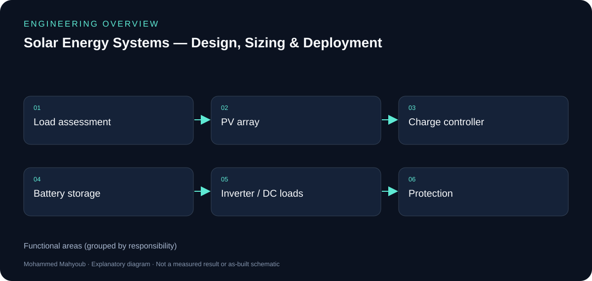
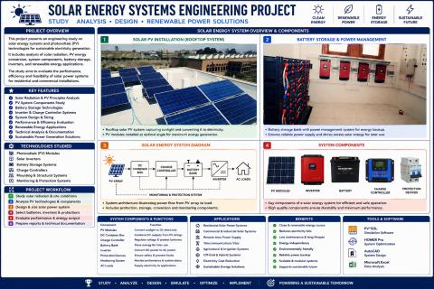

# Solar Energy Systems — Design, Sizing & Deployment — Engineering Guide

Designed and sized photovoltaic power systems, covering load assessment, array and battery sizing, inverter and charge-controller selection, and system protection.

## Visual overview

*New explanatory diagram; grouped responsibilities, not an as-built schematic or test result.*

*New explanatory workflow; a documentation aid, not evidence that every proposed check was performed.*

## Start with energy demand

Load assessment separates instantaneous power from energy consumed over time. Telecommunications equipment and infrastructure loads need an explicit operating schedule before array, storage and inverter choices can be explained.

## Sizing dependencies

Array sizing depends on solar resource and losses; battery sizing depends on usable energy and the intended autonomy; inverter selection depends on load characteristics. The diagram shows these dependencies without inventing site irradiance, equipment ratings or measured yield.

## Deployment documentation

The published scope covers wiring, protection, performance estimation and remote telecommunications supply/backup. The suggested evidence checklist calls for load schedules, sizing assumptions, component data and commissioning records. It does not claim that those source documents are already publicly available.

## Evidence to review or collect

The following are suggested review checks. A checklist entry is not a claimed pass result.

- Load schedule and daily energy.
- Solar resource/loss and autonomy assumptions.
- Component compatibility and cable/protection design.
- Commissioning readings and performance context.

## Sources and provenance

- [Published portfolio description](https://mahyoub88.github.io/#proj-solar-study).
- [Project README](../README.md) and existing repository files.
- [LinkedIn projects](https://www.linkedin.com/in/mohammed-mahyoub/details/projects/): supplementary descriptions and project media.
- New SVG figures and explanatory text were authored for this documentation update; they are not original photographs or new measured results.
- Reused JPG media were exported from the corresponding LinkedIn project media viewer. Source titles are preserved in the captions; no expiring image URLs are required.
- A source summary sheet is included below; physical-installation photographs and raw commissioning records were not available in the inspected public repository.

## Additional source media

*Solar Energy Systems — Design, Sizing & Deployment: existing LinkedIn experience media, exported from the media viewer. This is the available preview resolution; it is a source summary sheet/screenshot, not a new measurement.*

Source: [LinkedIn experience media](https://www.linkedin.com/in/mohammed-mahyoub/details/experience/).
